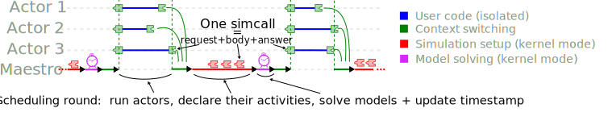
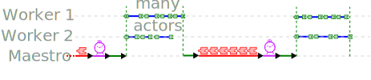

.. _design:

SimGrid Design Goals
######################

A SimGrid simulation boils down to a set of **actors** that use
**resources** by performing **activities**. SimGrid provides several kinds of
resources (link, CPU, disk, and synchronization objects such as mutexes
and semaphores) along with the corresponding kinds of activities
(communication, execution, I/O, synchronization). SimGrid users provide a
platform instantiation (sets of interconnected resources) and an
application (the code executed by actors) along with the actors'
placement on the platform.

The actors (i.e., the user code) can only interact with the platform
through activities, which are somewhat similar to synchronizations.  Some
are very natural (locking a mutex is a synchronization with the other
actors that use the same mutex). Others activities implement more atypical
kinds of synchronization: execution, communication, and I/O have a
quantitative component that depends on the resources. Regardless, in
SimGrid writing some data to disk, for instance, is seen as a
synchronization with the other actors that use the same disk. When you lock
a mutex, you can proceed only when that mutex gets unlocked by someone
else.  Similarly, when you do an I/O, you can proceed only once the disk
has delivered enough performance to fulfill your demand (while competing
with concurrent demands for that same disk made by other actors).
Communication activities have both a qualitative component (the actual
communication starts only when both the sender and receiver are ready to
proceed) and a quantitative component (consuming the communication power of
the link resources).

The design of SimGrid is driven by several design goals:

 - **reproducibility**: re-executing the same simulation must lead to
   the exact same outcome, even if it runs on another computer or
   operating system. When possible, this should also be true across different
   versions of SimGrid.
 - **sweet spot between simulation accuracy and simulation speed**: running a given simulation should be as fast as possible but predict
   correct performance trends (or even provide accurate predictions when correctly calibrated).
 - **versatility**: ability to simulate many kinds of distributed system and application, while remaining parsimonious so as to not hinder usability. SimGrid tries to provide sane
   default settings along with the possibility to augment and modify
   the provided models and their settings for each relevant use case.
 - **scalability**: ability to deal with very large simulations in terms of the
   number of actors, the size of the platform, the number of
   events, or all all the above.

Actors and activities
*********************

At the core of the SimGrid design lies the interactions between actors and
activities. For the sake of reproducibility, the actors cannot interact
directly with their environment: every interaction is serialized through a
central component that processes them in a reproducible order. For the sake
of speed, SimGrid is designed as an operating system: the actors issue
**simcalls** (akin to system calls) to a simulation kernel (akin to an OS
kernel) called the **maestro** that decides which actors can proceed and
which ones must wait.

A SimGrid simulation proceeds as a sequence of **scheduling
rounds**. At each round, all actors that are not currently blocked on a
simcall get executed. This is done by the maestro, which passes the control flow to the
code of each actor, written by the user in either C++, C, Fortran or Python.
The control flow is returned to the maestro when the actor
blocks on its next simcall. If the time it takes to
execute the actor's code is of import to the simulator, it has to be the object
of execution activities.  SMPI programs are automatically benchmarked, but 
these execution activities must be manually created if using S4U. The simulated
time is discrete in SimGrid and only progresses between scheduling
rounds. So all events occurring during a given scheduling round occur
at the exact same simulated time, even if the actors are usually
executed sequentially on a real platform.

To modify their environment actors issue either **immediate
simcalls** that take no time in the simulation (e.g., spawning another
actor), or **blocking simcalls** that must wait for future events (e.g.,
mutex locks require the mutex to be unlocked by its owner;
communications wait for the network to provide have provided enough communication
bandwidth to transfer the data). A given scheduling round is
usually composed of several sub-scheduling rounds during which
immediate simcalls are resolved. This ends when all actors are either
terminated or within a blocking simcall. The simulation models are
then used to compute the time at which the first pending simcall
terminates. Time is advanced to that point, and a new scheduling
round begins with all actors that became unblocked at that timestamp.

Context switching between the actors and maestro is highly optimized
for the sake of simulation performance. SimGrid provides several
implementations of this mechanism, called **context factories**. These
implementations fall into two categories: Preemptive contexts are
based on standard system threads from the libstdc library.
They are usually better supported by external
debuggers and profiling tools, but less efficient. The most efficient
factories use non-preemptive mechanisms, such as SysV's ucontexts,
boost's context, or our own hand-tuned implementation, that is written
in assembly language. This is possible because a given actor is never
interrupted between consecutive simcalls in SimGrid.

For the sake of performance, actors can be executed in parallel using several system threads which execute all actors in
turn. In our experience, however, this rarely leads to significant performance improvement because most applications simulated with 
SimGrid are fine-grained: it's often not worth simulating actors in parallel because the amount of work performed by each actor is too
small. This is because the users tend to abstract away any large computations to simulate the control flow of their
application efficiently. In addition, parallel simulation puts restrictions on the user's code. 
For example, the existing SMPI implementation cannot be used in parallel yet.

Parsimonious model versatility
******************************

Another main design goal of SimGrid is parsimonious versatility in
modeling, that is, aiming to simulate very different things using the same
simulation abstractions. To achieve this goal, the SimGrid implementation
tends to unify all resource kinds and activity kinds. For instance, the
classical notion of **computational power** is mirrored for
**communication power** and **I/O power**. Asynchronous executions are less
common than the asynchronous communications that proliferate in MPI but
they are still provided for sake of symmetry: they even prove useful to
simulate thread pools efficiently. SimGrid also provides asynchronous mutex
locks for symmetry. The notion of **pstate** was introduced to model the
step-wise variation of computational speed depending on the DVFS, and was
reused to model the bootup and shutdown phases of a CPU: the computational
speed is 0 at these specific pstates. This pstate notion was extended to
represent the fact that the bandwidth provided by a wifi link to a given
station depends on its signal-noise ratio (SNR). In summary, simulation
abstractions are re-used and/or generalized as much as possible to serve a
wide range of purposes.

Furthermore, all provided resource models are very similar internally. They
:ref:`rely on linear inequation systems <models-lmm>`, stating for example
that the sum of the computational power received by all computation
activities located on a given CPU cannot exceed the computational power
provided by this CPU. This extends nicely to multi-resources activities
such as communications that use several links, and also to parallel tasks
(abstract activities representing a parallel execution kernel that consumes
both the communication and computational power of a set of machines) or
fluid I/O streams (abstract activities representing a data stream from disk
to disk through the network). Specific coefficients are added to the linear
system to mimic how the resources behavior in the real world. The resulting
system is then solved using a max-min objective function that maximizes the
minimum of all shares allocated to activities. Our experience shows that
this approach can successfully be used for fast yet accurate simulations of
complex phenomena, provided that the model's coefficients and constants are
carefully :ref:`calibrated <models_calibration>`, i.e. tailored and
instantiated to that phenomenon.

Model-checking
**************

Even if it was not in its original goals, SimGrid now
integrates a full-featured model-checker (dubbed MC or Mc SimGrid)
that can exhaustively explore all execution paths that the application
could experience. Conceptually, Mc SimGrid is built upon the ideas
presented previously. Instead of using the resource models to compute
the order of simcall terminations, it explores every order that is
causally possible. In a simulation entailing only three concurrent
events (i.e., simcalls) A, B, and C, it will first explore the
scenario where the activities order is ABC, then ACB, then
BAC, then BCA, then CAB and finally CBA. Of course, the number of
scenarios to explore grows exponentially with the number of simcalls
in the simulation. Mc SimGrid leverages reduction techniques to avoid
re-exploring redundant traces.

In practice, Mc SimGrid can be used to verify classical `safety and
liveness properties
<https://en.wikipedia.org/wiki/Linear_time_property>`_, but also
`communication determinism
<https://hal.inria.fr/hal-01953167/document>`_, a property that allows
more efficient solutions toward fault-tolerance. It can alleviate the
state space explosion problem through `Dynamic Partial Ordering
Reduction (DPOR)
<https://en.wikipedia.org/wiki/Partial_order_reduction>`_ and `state
equality <https://hal.inria.fr/hal-01900120/document>`_.

Mc SimGrid is more experimental than other parts of SimGrid, such as SMPI that can now be used to run many full-featured
MPI codes out of the box, but it's constantly improving.
