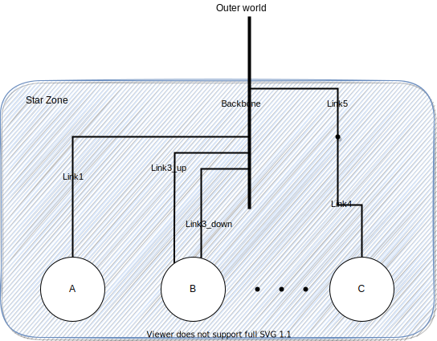

.. raw:: html

   <object id="TOC" data="graphical-toc.svg" type="image/svg+xml"></object>
   
    
    

.. _platform_examples:

Network Topology Examples
=========================

.. _platform_example_3hosts:

Simple Example with 3 hosts
---------------------------

Imagine you want to describe a little platform with three hosts,
interconnected as follows:

.. image:: /tuto_smpi/3hosts.png
   :align: center

This can be done with the following platform file, that considers the
simulated platform as a graph of hosts and network links.

.. literalinclude:: /tuto_smpi/3hosts.xml
   :language: xml

The elements basic elements (with :ref:`pf_tag_host` and
:ref:`pf_tag_link`) are described first, and then the routes between
any pair of hosts are explicitly given with :ref:`pf_tag_route`.

Any host must be given a computational speed in flops while links must
be given a latency and a bandwidth. You can write 1Gf for
1,000,000,000 flops (full list of units in the reference guide of
:ref:`pf_tag_host` and :ref:`pf_tag_link`).

Routes defined with :ref:`pf_tag_route` are symmetrical by default,
meaning that the list of traversed links from A to B is the same as
from B to A. Explicitly define non-symmetrical routes if you prefer.

The last thing you must know on SimGrid platform files is that the
root tag must be :ref:`pf_tag_platform`. If the ``version`` attribute
does not match what SimGrid expects, you will be hinted to use to the
``simgrid_update_xml`` utility to update your file.

There is often more than one way to model a given platform. For example, the above platform could also be
:ref:`expressed using a shortest path algorithm <platform_rm_shortest>` instead of explicitely listing all routes as in
the example above.

Cluster with a Crossbar
-----------------------

A very common parallel computing platform is a homogeneous cluster in
which hosts are interconnected via a crossbar switch with as many
ports as hosts, so that any disjoint pairs of hosts can communicate
concurrently at full speed. For instance:

.. literalinclude:: ../../examples/platforms/cluster_crossbar.xml
   :language: xml
   :lines: 1-3,18-

One specifies a name prefix and suffix for each host, and then give an
integer range. In the example the cluster contains 65535 hosts (!),
named ``node-0.simgrid.org`` to ``node-65534.simgrid.org``. All hosts
have the same power (1 Gflop/sec) and are connected to the switch via
links with same bandwidth (125 MBytes/sec) and latency (50
microseconds).

.. todo::

   Add the picture.

Cluster with a Shared Backbone
------------------------------

Another popular model for a parallel platform is that of a set of
homogeneous hosts connected to a shared communication medium, a
backbone, with some finite bandwidth capacity and on which
communicating host pairs can experience contention. For instance:

.. literalinclude:: ../../examples/platforms/cluster_backbone.xml
   :language: xml
   :lines: 1-3,18-

The only differences with the crossbar cluster above are the ``bb_bw``
and ``bb_lat`` attributes that specify the backbone characteristics
(here, a 500 microseconds latency and a 2.25 GByte/sec
bandwidth). This link is used for every communication within the
cluster. The route from ``node-0.simgrid.org`` to ``node-1.simgrid.org``
counts 3 links: the private link of ``node-0.simgrid.org``, the backbone
and the private link of ``node-1.simgrid.org``.

.. todo::

   Add the picture.

Torus Cluster
-------------

Many HPC facilities use torus clusters to reduce sharing and
performance loss on concurrent internal communications. Modeling this
in SimGrid is very easy. Simply add a ``topology="TORUS"`` attribute
to your cluster. Configure it with the ``topo_parameters="X,Y,Z"``
attribute, where ``X``, ``Y`` and ``Z`` are the dimension of your
torus.

.. image:: ../../examples/platforms/cluster_torus.svg
   :align: center

.. literalinclude:: ../../examples/platforms/cluster_torus.xml
   :language: xml

Note that in this example, we used ``loopback_bw`` and
``loopback_lat`` to specify the characteristics of the loopback link
of each node (i.e., the link allowing each node to communicate with
itself). We could have done so in previous example too. When no
loopback is given, the communication from a node to itself is handled
as if it were two distinct nodes: it goes twice through the private
link and through the backbone (if any).

.. _platform_examples_fattree:

Fat-Tree Cluster
----------------

This topology was introduced to reduce the amount of links in the
cluster (and thus reduce its price) while maintaining a high bisection
bandwidth and a relatively low diameter. To model this in SimGrid,
pass a ``topology="FAT_TREE"`` attribute to your cluster. The
``topo_parameters=#levels;#downlinks;#uplinks;link count`` follows the
semantic introduced in the `Figure 1B of this article
<http://webee.eedev.technion.ac.il/wp-content/uploads/2014/08/publication_574.pdf>`_.

Here is the meaning of this example: ``2 ; 4,4 ; 1,2 ; 1,2``

- That's a two-level cluster (thus the initial ``2``).
- Routers are connected to 4 elements below them, regardless of its
  level. Thus the ``4,4`` component that is used as
  ``#downlinks``. This means that the hosts are grouped by 4 on a
  given router, and that there is 4 level-1 routers (in the middle of
  the figure).
- Hosts are connected to only 1 router above them, while these routers
  are connected to 2 routers above them (thus the ``1,2`` used as
  ``#uplink``).
- Hosts have only one link to their router while every path between a
  level-1 routers and level-2 routers use 2 parallel links. Thus the
  ``1,2`` that is used as ``link count``.

.. image:: ../../examples/platforms/cluster_fat_tree.svg
   :align: center

.. literalinclude:: ../../examples/platforms/cluster_fat_tree.xml
   :language: xml
   :lines: 1-3,10-

.. todo:

   Model some other platforms, for example from https://link.springer.com/article/10.1007/s11227-019-03142-8

Dragonfly Cluster
-----------------

This topology was introduced to further reduce the amount of links
while maintaining a high bandwidth for local communications. To model
this in SimGrid, pass a ``topology="DRAGONFLY"`` attribute to your
cluster. It's based on the implementation of the topology used on
Cray XC systems, described in paper
`Cray Cascade: A scalable HPC system based on a Dragonfly network <https://dl.acm.org/citation.cfm?id=2389136>`_.

System description follows the format ``topo_parameters=#groups;#chassis;#routers;#nodes``
For example, ``3,4 ; 3,2 ; 3,1 ; 2``:

- ``3,4``: There are 3 groups with 4 links between each (blue level).
  Links to nth group are attached to the nth router of the group
  on our implementation.
- ``3,2``: In each group, there are 3 chassis with 2 links between each nth router
  of each group (black level)
- ``3,1``: In each chassis, 3 routers are connected together with a single link
  (green level)
- ``2``: Each router has two nodes attached (single link)

.. image:: ../../examples/platforms/cluster_dragonfly.svg
   :align: center

.. literalinclude:: ../../examples/platforms/cluster_dragonfly.xml
   :language: xml

Star Zone
---------

In a Star topology, as the name says, nodes are organized following a star.
It's similar to a cluster topology but you have the flexibility to set
different route for every component in the star.
Unfortunately, it's only available in the C++ interface.

The particularity of this zone is how routes are declared. Instead of declaring the
source and destination, routes are described from a node to everybody else or from
everybody else to the node. In the example, the node *A* uses the *Link1* and *Backbone*
to communicate with other nodes (note that this is valid for both nodes inside or outside
the zone). More precisely, a communication from node *A* to *B* would use links: *Link1, Backbone,
Link3_down*. Note that duplicated links are removed from the route, i.e. in this example we'll use *Backbone*
only once.

Also, note that the nodes (A, B and C) can be either hosts or other zones. In case of using zones,
set the gateway parameter properly when adding the route.

The following code illustrates how to create this Star Zone and add the appropriates routes.

.. code-block:: cpp

    auto* zone = sg4::create_star_zone("star");
    /* create hosts */
    const sg4::Host* hostA = zone->create_host("A", 1e9)->seal();
    const sg4::Host* hostB = zone->create_host("B", 1e9)->seal();

    /* create links */
    sg4::Link* link1      = zone->create_link("link1", 1e6)->seal();
    sg4::Link* link3_up   = zone->create_link("link3_up", 1e6)->seal();
    sg4::Link* link3_down = zone->create_link("link3_down", 1e6)->seal();
    sg4::Link* backbone   = zone->create_link("backbone", 1e9)->seal();

    /* symmetric route route: A->ALL and ALL->A, shared link1 */
    zone->add_route(hostA->get_netpoint(), nullptr, nullptr, nullptr,
                    std::vector<sg4::Link*>{link1, backbone}, true);
    /* route host B -> ALL, split-duplex link3, direction UP */
    zone->add_route(hostB->get_netpoint(), nullptr, nullptr, nullptr,
                    std::vector<sg4::Link*>{link3_up, backbone}, false);
    /* route host ALL -> B, split-duplex link3, direction DOWN */
    zone->add_route(nullptr, hostB->get_netpoint(), nullptr, nullptr,
                    std::vector<sg4::Link*>{backbone, link3_down}, false);

.. todo:: Complete this page of the manual.

   SimGrid comes with an extensive set of platforms in the
   `examples/platforms <https://framagit.org/simgrid/simgrid/tree/master/examples/platforms>`_
   directory that should be described here.
