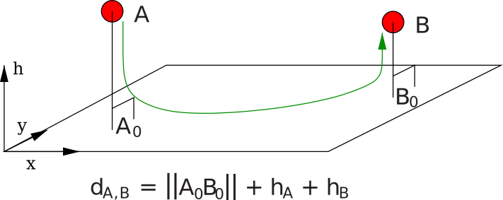

.. raw:: html

   <object id="TOC" data="graphical-toc.svg" type="image/svg+xml"></object>
   
    
    

.. _platform_routing:

Advanced routing
################

SimGrid platforms are divided in networking zones (:ref:`pf_tag_zone`) to compose larger platforms from smaller parts.
This factorizes the description and improves the simulation performance, both in time and in size. Any zone may contain
sub-zones, allowing for a hierarchical decomposition of the platform as depicted in the example below. Inter-zone routes
are then factorized with :ref:`pf_tag_zoneRoute`.

In addition to the efficiency improvement, multi-zones routing also improve the modeling expressiveness, as each zone
can use different models. For example, you can have a coordinate-based routing for the WAN parts of your platform, a
full routing within each datacenter, and a highly optimized routing within each cluster of the datacenter. In all cases,
SimGrid strives to compute routes in a time- and space-efficient manner.

|flat_img| |tree_img|

.. |flat_img| image:: img/zone_hierarchy.png
   :width: 45%

.. |tree_img| image:: img/zone_tree.svg
   :width: 45%

Both images above represent the same platform. On the left, circles represent hosts (i.e. processing units) and squares
represent network routers. Bold lines represent communication links. The zone "AS2" models the core of a national
network interconnecting a small flat cluster (AS4) and a larger hierarchical cluster (AS5), a subset of a LAN (AS6), and
a set of peers scattered around the world (AS7). On the right, the corresponding hierarchy of zones is highlighted.

Routing models
**************

Each zone implements a routing strategy according to the ``routing`` attribute of :ref:`pf_tag_zone`.

Explicit routing
================

When ``routing=full``, all routes must be explicitly given using the :ref:`pf_tag_route` and :ref:`pf_tag_link_ctn` tags.
This routing model is both simple and inefficient :) It is OK to not specify each and every route between hosts, as
long as you do not try to start a communication on any of the missing routes during your simulation.

.. _platform_rm_shortest:

Shortest path
=============

SimGrid can compute automatically the paths between all pair of hosts in a zone. You just need to provide the one-hop routes to connect all hosts.
Two algorithms are provided: 

  - ``routing=Floyd``: use the number of hops to build shortest path. It is calculated only once at the beginning of the
    simulation.
  - ``routing=Dijksta``: shortest-path calculated considering the path's latency. As the latency of links can change
    during simulation, it is recomputed each time a route is necessary.
  - ``routing=DijkstraCache``: Just like the regular Dijkstra, but with a cache of previously computed paths for performance.

Here is a small example describing a star-shaped zone depicted below. The path from e.g. *host0* to *host1* will be
computed automatically at startup. Another way to describe the same platform can be found :ref:`here
<platform_example_3hosts>`, with a full routing and without the central router.

.. code-block:: XML

   <?xml version='1.0'?>
   <!DOCTYPE platform SYSTEM "https://simgrid.org/simgrid.dtd">
   <platform version="4.1">
     <zone id="my zone" routing="Floyd">
       <host id="host0" speed="1Gf"/>
       <host id="host1" speed="2Gf"/>
       <host id="host2" speed="40Gf"/>
       <link id="link0" bandwidth="125MBps" latency="100us"/>
       <link id="link1" bandwidth="50MBps" latency="150us"/>
       <link id="link2" bandwidth="250MBps" latency="50us"/>
       <router id="center"/>
       <!-- Only 1-hop routes for topological information. Missing routes are computed with Floyd -->
       <route src="center" dst="host0"><link_ctn id="link0"/></route>
       <route src="center" dst="host1"><link_ctn id="link1"/></route>
       <route src="center" dst="host2"><link_ctn id="link2"/></route>
     </zone>
   </platform>

.. image:: /tuto_smpi/3hosts.png
   :align: center

Clusters
========

TODO

  - **Cluster/Fat-Tree/DragonFly/Torus**: routing is defined by the topology, automatically created.
    These zones must be defined through the :ref:`pf_tag_cluster` tag in the XML.
  - **Star**: star-like topology. Users describe routes from/to every host in the zone.

Vivaldi
=======

This routing model is particularly well adapted to Peer-to-Peer and Clouds platforms: each component is connected to the
cloud through a private link of which the upload and download rate may be asymmetric.

The network core (between the private links) is assumed to be over-sized so only the latency is taken into account.
Instead of a matrix of latencies that would become too large when the amount of peers grows, Vivaldi netzones give a
coordinate to each peer and compute the latency between host A=(xA,yA,zA) and host B=(xB,yB,zB) as follows:

  latency = sqrt( (xA-xB)² + (yA-yB)² ) + zA + zB

The resulting value is assumed to be in milliseconds.

So, to go from a host A to a host B, the following links would be used: ``private(A)_UP``, ``private(B)_DOWN``, with the
additional latency computed above. The bandwidth of the UP and DOWN links is not symmetric (in contrary to usual SimGrid
links), but naturally correspond to the values provided when the peer was created. See also :ref:`pf_tag_peer`.

The script ``examples/platforms/syscoord/generate_peer_platform.pl`` in the archive can be used to convert the
coordinate-based platforms from the OptorSim project into SimGrid platform files.

Such Network Coordinate systems were shown to provide rather good latency estimations in a compact way. Other systems,
such as `Phoenix network coordinates <https://en.wikipedia.org/wiki/Phoenix_network_coordinates>`_ were shown
superior to the Vivaldi system and could be also implemented in SimGrid.
    
Here is a small platform example:

.. code-block:: XML

   <?xml version='1.0'?>
   <!DOCTYPE platform SYSTEM "https://simgrid.org/simgrid.dtd">
   <platform version="4">

    <zone  id="zone0"  routing="Vivaldi">
       <peer id="peer-0" coordinates="173.0 96.8 0.1" speed="730Mf" bw_in="13.38MBps" bw_out="1.024MBps" lat="500us"/>
       <peer id="peer-1" coordinates="247.0 57.3 0.6" speed="730Mf" bw_in="13.38MBps" bw_out="1.024MBps" lat="500us" />
       <peer id="peer-2" coordinates="243.4 58.8 1.4" speed="730Mf" bw_in="13.38MBps" bw_out="1.024MBps" lat="500us" />
    </zone>
  </platform>

Wi-Fi
=====

TODO

.. _pf_routes:

Describing routes
*****************

If you want to define a route within a given zone, you simply have to use the :ref:`pf_tag_route` tag, providing the
``src``, ``dst`` parameters along with the list of links to use from ``src`` to ``dst``.

Defining a route between two separate zones with :ref:`pf_tag_zoneroute` takes more parameters: ``src``, ``dst``,
``gw_src`` (source gateway) and ``gw_dst`` (destination gateway) along with the list of links. Afterward, the path from
``src_host`` in zone ``src`` to ``dst_host`` in zone ``dst`` is composed of 3 segments. First, move within zone ``src`` from
``src_host`` to the specified gateway ``gw_src``. Then, traverse all links specified by the zoneRoute (purportedly within
the common ancestor) and finally, move within zone ``dst`` from ``gw_dst`` to ``dst_host``. 

SimGrid enforces that each gateway is within its zone, either directly or in a sub-zone to ensure that the algorithm
described in the next section actually works.

TODO: bypassRoute

Calculating network paths
*************************

Computing the path between two hosts is easy when they are located in the same zone. It is done directly by the routing
algorithm of that zone. Full routing looks in its table, Vivaldi computes the distance between peers, etc.

When communicating through several zones, a recursive algorithm is used. As an illustration, we will apply this
algorithm to a communication between `host1` in `AS1` and `host2` in `AS5-4`, in our previous topology. This section
only gives an overview of the algorithm used. You should refer to the source code for the full details, in
``NetZoneImpl::get_global_route()``.

.. image:: ./img/zoom_comm.svg
   :scale: 70%

1. **Find common ancestor** zone of ``src`` and ``dst``, the ancestors of ``src`` and ``dst`` and how they are connected.

   In our case, *AS1* is the common ancestor while *AS2* and *AS5* are the respective ancestors of ``src`` and ``dst``.
   Assume that the relevant route was defined as follows:

   .. code-block:: XML

        <zoneRoute src="AS2" dst="AS5" gw_src="Host1" gw_dst"="gw1">
            <link_ctn id="Link1">
        </zoneRoute>

2. **Add the route up to the ancestor**, i.e. from ``src`` to the ``gw_src`` in the route between ancestor zones. This is a recursive call to the current algorithm.

   That's easy in our case, as both ``src`` and ``gw_src`` are *Host1*, so that route segment is empty. If we were to compute the path from *Host3* to *Host2*, we would have to add the route from *Host3* to the gateway that is *Host1*

3. **Add the zoneRoute between ancestors**.

   From the XML fragment above defining the zoneRoute between *AS2* and *AS5*, we need to add ``Link1`` to the path.

4. **Add the route down from the ancestor**, i.e. from ``gw_dst`` to ``dst`` in the route between ancestor zones. This is another recursive call to the current algorithm.

   Here, we need the route from *gw1* and *host2*. The common ancestor is *AS5*, and the relative ancestors are *AS5-4* and *AS5-3*. This route is defined as follows (routes are symmetrical by default).

   .. code-block:: XML

        <zoneRoute src="AS5-4" dst="AS5-3" gw_src="gw2" gw_dst"="gw1">
            <link_ctn id="Link3">
        </zoneRoute>

   So to compute the route from *gw1* to *Host2*, we need to add:

     - the route from the source to the gateway, i.e. from *gw1* to *gw1* (empty route segment),
     - the links listed in the zoneRoute (*Link3*)
     - the route from the gateway to the destination, i.e. from *gw2* to *Host2* (they are in the same zone *AS5-4*, and that path is limited to *Link2*). The last segment is because of the following fragment:

       .. code-block:: XML

          <route> src="Host2" dst="gw2">
            <link_ctn id="Link2">
          </route>

In the end, our communication from *Host1@AS2* to *Host2@AS5-4* follows this path: ``{Link1, Link3, Link2}`` 

Loopback links
**************

Loopback links are used when from an host to itself (they are excluded in the recursive search described above). As it
can be quite tedious to describe each a loopback link for each host in the platform, SimGrid provides a default global
**FATPIPE** link which is used by all hosts. Its bandwidth is 10GBps while its latency is 0ms, but these arbitrary
values should changed through configuration to reflect your environment (see :ref:`cfg=network/loopback`).

To give a specific loopback link to a given host, simply a add :ref:`pf_tag_route` from this node to itself. SimGrid
will then use the provided link(s) as a loopback for this host instead of the global one.

.. code-block:: XML

    <link id="loopback" bandwidth="100MBps" latency="0"/>
    <route src="Tremblay" dst="Tremblay">
      <link_ctn id="loopback"/>
    </route>

Some zones such as :ref:`pf_tag_cluster` provide ways to describe the characteristics of
the loopback nodes inside the zone. 

.. |br| raw:: html

    
