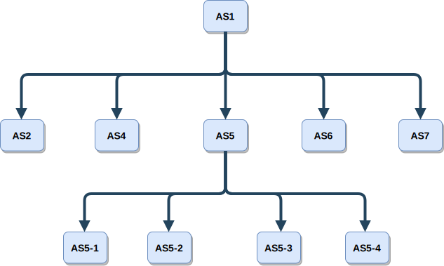
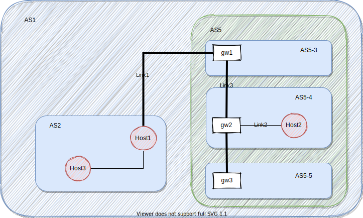

.. raw:: html

   <object id="TOC" data="graphical-toc.svg" type="image/svg+xml"></object>
   
    
    

.. _platform_routing:

Demystifying the routing
########################

When describing a platform, routing is certainly the most complex
and error-prone part. This section explains the basics of SimGrid's
routing mechanism which allows you to easily compose and scale your
platform.

|flat_img| |tree_img|

.. |flat_img| image:: img/zone_hierarchy.png
   :width: 45%

Circles represent processing units and squares represent network
routers. Bold lines represent communication links. The zone "AS2" models the core of a national network interconnecting a
small flat cluster (AS4) and a larger hierarchical cluster (AS5), a
subset of a LAN (AS6), and a set of peers scattered around the world
(AS7).

Networking zones (:ref:`pf_tag_zone`) are an advanced concept used to factorize the description
to reduce the size of your platform on disk and in memory.
Any zone may contain sub-zones, allowing for a hierarchical
decomposition of the platform (as you can see in the tree representation on the left).
Routing can be made more efficient (as the
inter-zone routing gets factored with :ref:`pf_tag_zoneroute`) and
allows you to have more than one routing model in your platform. For
example, you can have a coordinate-based routing for the WAN parts
of your platforms, a full routing within each datacenter, and a highly
optimized routing within each cluster of the datacenter.  In this
case, determining the route between two given hosts gets 
"somewhat more complex" but SimGrid still computes
these routes for you in a time- and space-efficient manner.

Routing basic elements: hosts and links
***************************************

A platform is composed of a set of resources, namely hosts, links and disks.
On these resources you may run activities that will require some capacity and
will make the time advance.

Given a look at this example of some hosts and links being declared

.. code-block:: xml

  <zone id="AS5-4" routing="Full">
    <host id="host0" speed="1Gf"/>
    <host id="host1" speed="2Gf"/>
    <link id="link0" bandwidth="125MBps" latency="100us"/>
  </zone>

It describes a simple FullZone with 2 hosts inside connected through
a link. Note that the ``link0`` just represents a resource with a
certain bandwidth capacity and latency. It's only when you add
a route between ``host0`` and ``host1`` that this link will be used by
SimGrid in the communications.

.. code-block:: xml

  <zone id="AS5-4" routing="Full">
    ...
    <route src="host0" dst="host1"><link_ctn id="link0"/></route>
  </zone>

Note that no verification is performed concerning the links you use in a route.
This is quite flexible and enables interesting features. However, it also allows you
to do some strange topologies, such as having a single link used by a pair
of hosts from different zone:

.. code-block:: xml

  <zone id="Nonsense" routing="Full">
    <host id="host3" speed="1Gf"/>
    <host id="host4" speed="2Gf"/>
    <route src="host3" dst="host4"><link_ctn id="link0"/></route>
  </zone>

Probably you do not want to do this, but it's your responsibility to write
your platform file properly. SimGrid will not try to be smarter than you!

Describing routes: intra vs inter
*********************************

Intra zone
==========

TLDR: use :ref:`pf_tag_route`

The communications inside a given zone is defined by ``routing=`` parameter
in the :ref:`pf_tag_zone`. For example, in a *Full* zone, the user must declare
a :ref:`pf_tag_route` for each pair of hosts inside the zone. Other zones, such as *Floyd*
or *Dijkstra* will calculate the shortest path, while *DragonFly* and *Fat-Tree* uses
specialized routing algorithms to improve performance.

When adding a route inside a zone, keep in mind that you need 3 main parameters:
  - src: Host (or router) source
  - dst: Host (or router) destination
  - links: list of resources (links in this case) used in the communication

Inter zone
==========

TLDR: use :ref:`pf_tag_zoneroute`

When describing complex topologies, such as the one depicted in the beginning
of this page, you will need to connected not only hosts but zones too. The rationale
behind a route between zone is exactly the same as for hosts. The only difference is
the 2 new gateway parameters in the syntax of :ref:`pf_tag_zoneroute`.

A zone is not a physical resource, just a collection of resources. Consequently, you
need to describe the gateway, i.e. the physical resource inside the zone used for the route.
It gives you 4 parameters to describe a zoneRoute:
  - src: The object of source zone
  - dst: The object of destination zone
  - gw_src: Gateway inside src zone. A Host (or router) belonging to src zone.
  - gw_dst: Gateway inside dst zone. A Host (or router) belonging to src zone.
  - links: Links that connect gw_src to gw_dst.

.. note:: You must be careful to call zoneRoute with the correct parameters: zones for src and dst, and hosts/routers for gw_src and gw_dst

.. warning:: SimGrid does not have the concept of default gateway/router. Each zoneRoute must describe the appropriate gateways which may be different for each route.

Calculating the routes
**********************

This section is not mandatory for a normal SimGrid user. However, if you want
to know a little more of we calculate the route
between nodes inside SimGrid, keep reading it.

Intra-zone communications
=========================

This is the easy, happy case. When
a host wants to communicate with another host belonging to the same
zone, it is the zone's duty to find the list of links that are
involved in the communication.

As we stated earlier, each zone implements a different strategy, defined
through the ``routing=`` parameter.
  - **Full**: all routes must be explicitly given using the
    :ref:`pf_tag_route` and :ref:`pf_tag_link_ctn` tags (this :ref:`routing
    model <pf_rm>` is both simple and inefficient :). It is OK to not
    specify each and every route between hosts, as long as you do not try
    to start a communication on any of the missing routes during your
    simulation.
  - **Dijkstra/Floyd**: calculates the shortest path between each pair
    of nodes using the routes described by the user (:ref:`pf_tag_route`).
    As long as you graph is connected, no problems.
  - **Cluster/Fat-Tree/DragonFly/Torus**: routing is defined by the topology, automatically created.
  - **Star**: star-like topology. Users describe routes from/to every host in the zone.
  - **Vivaldi/Wi-Fi**: "fully-connected" zones with special characteristics.

    
Inter-zone communications
=========================

Inter-zone communications are a little more complicated since you need to pass
through several zones. Let's give a look with more details in a communication
within our initial topology.

In this case, *Host1* within *AS2* wants to communicate with *Host2* from *AS5-4*.
As we can see, they're not part of the same zone nor have direct links connecting
them. The routing procedure is as follows:

1. **Find common root and ancestors**: As a SimGrid's platform is a tree of zones,
   it is assured that we have a common zone that includes both hosts. Also, we need
   the zone within the root zone that contains the hosts. In our case, we have:

   - **Common root**: *AS1*, it is the root zone that contains all hosts in our example

   - **Src ancestor**: *AS2*, it is the own *Host1's* zone.

   - **Dst ancestor**: *AS5*, it's the *AS5* that contains *AS5-4*.

2. **Adding route from src to dst ancestor**: Ask *AS1* for the route between *AS2* and *AS5*.
   Add *Link1* to our list of links

3. **Recursively search for route between hosts (Host1/Host2) and ancestors (AS2, AS5)**

   3.1. **Route from Host1 to AS2's gateway (Host1)**: nothing to do, same zone.

   3.2. **Route from Host2 to AS5's gateway (gw1)**: start step 1 again, searching
   for a common root (*AS5* in this case) and the common ancestors (*AS5-4* and *AS5-3*).
   Add *Link3* to list of links.

4. **Add local links in src and dst zones**

   4.1. **Route from Host1 to AS2's gateway**: same node, no link to add.

   4.2. **Route from Host2 to AS5-4's gateway**: follow intra-zone and add *Link2*.

In the end, our communication from *Host1/AS2* to *Host2/AS5-4* will pass through
the links: *Link1, Link3* and *Link2*.

Note that a communication between *Host3/AS2* and *Host2/AS5-4* follow the same procedure, except
for step 4.1 where we would add the link between *Host3* and *Host1* inside *AS2* zone.

