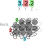
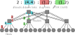
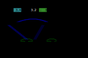

.. _usecase_smpi:

Simulating MPI Applications
===========================

Discover SMPI
-------------

SimGrid can not only :ref:`simulate algorithms <usecase_simalgo>`, but
it can also be used to execute real MPI applications on top of
virtual, simulated platforms with the SMPI module. Even complex
C/C++/F77/F90 applications should run out of the box in this
environment. In fact, almost all proxy apps provided by the `ExaScale
Project <https://proxyapps.exascaleproject.org/>`_ only require minor
modifications to `run on top of SMPI
<https://framagit.org/simgrid/SMPI-proxy-apps>`_.

This setting permits one to debug your MPI applications in a perfectly
reproducible setup, with no Heisenbugs. Enjoy the full Clairvoyance
provided by the simulator while running what-if analyses on platforms
that are still to be built! Several `production-grade MPI applications
<https://framagit.org/simgrid/SMPI-proxy-apps#full-scale-applications>`_
use SimGrid for their integration and performance testing.

MPI 2.2 is already partially covered: over 160 primitives are
supported. Some parts of the standard are still missing: MPI-IO, MPI3
collectives, spawning ranks, inter-communicators, and some others. If
one of the functions you use is still missing, please drop us an
email. We may find the time to implement it for you.

Multi-threading support is very limited in SMPI. Only funneled
applications are supported: at most one thread per rank can issue any
MPI calls. For better timing predictions, your application should even
be completely mono-threaded. Using OpenMP (or pthreads directly) may
greatly decrease SimGrid predictive power. That may still be OK if you
only plan to debug your application in a reproducible setup, without
any performance-related analysis.

How does it work?
.................

In SMPI, communications are simulated while computations are
emulated. This means that while computations occur as they would in
the real systems, communication calls are intercepted and achieved by
the simulator.

To start using SMPI, you just need to compile your application with
``smpicc`` instead of ``mpicc``, or with ``smpiff`` instead of
``mpiff``, or with ``smpicxx`` instead of ``mpicxx``. Then, the only
difference between the classical ``mpirun`` and the new ``smpirun`` is
that it requires a new parameter ``-platform`` with a file describing
the simulated platform on which your application shall run.

Internally, all ranks of your application are executed as threads of a
single unix process. That's not a problem if your application has
global variables, because ``smpirun`` loads one application instance
per MPI rank as if it was another dynamic library. Then, MPI
communication calls are implemented using SimGrid: data is exchanged
through memory copy, while the simulator's performance models are used
to predict the time taken by each communications. Any computations
occurring between two MPI calls are benchmarked, and the corresponding
time is reported into the simulator.

.. image:: /tuto_smpi/img/big-picture.svg
   :align: center

Describing Your Platform
------------------------

As a SMPI user, you are supposed to provide a description of your
simulated platform, that is mostly a set of simulated hosts and network
links with some performance characteristics. SimGrid provides a plenty
of :ref:`documentation <platform>` and examples (in the
`examples/platforms <https://framagit.org/simgrid/simgrid/tree/master/examples/platforms>`_
source directory), and this section only shows a small set of introductory
examples.

Feel free to skip this section if you want to jump right away to usage
examples.

Simple Example with 3 hosts
...........................

Imagine you want to describe a little platform with three hosts,
interconnected as follows:

.. image:: /tuto_smpi/3hosts.png
   :align: center

This can be done with the following platform file, that considers the
simulated platform as a graph of hosts and network links.

.. literalinclude:: /tuto_smpi/3hosts.xml
   :language: xml

The elements basic elements (with :ref:`pf_tag_host` and
:ref:`pf_tag_link`) are described first, and then the routes between
any pair of hosts are explicitly given with :ref:`pf_tag_route`. 

Any host must be given a computational speed in flops while links must
be given a latency and a bandwidth. You can write 1Gf for
1,000,000,000 flops (full list of units in the reference guide of 
:ref:`pf_tag_host` and :ref:`pf_tag_link`). 

Routes defined with :ref:`pf_tag_route` are symmetrical by default,
meaning that the list of traversed links from A to B is the same as
from B to A. Explicitly define non-symmetrical routes if you prefer.

Cluster with a Crossbar
.......................

A very common parallel computing platform is a homogeneous cluster in
which hosts are interconnected via a crossbar switch with as many
ports as hosts, so that any disjoint pairs of hosts can communicate
concurrently at full speed. For instance:

.. literalinclude:: ../../examples/platforms/cluster_crossbar.xml
   :language: xml
   :lines: 1-3,18-

One specifies a name prefix and suffix for each host, and then give an
integer range. In the example the cluster contains 65535 hosts (!),
named ``node-0.simgrid.org`` to ``node-65534.simgrid.org``. All hosts
have the same power (1 Gflop/sec) and are connected to the switch via
links with same bandwidth (125 MBytes/sec) and latency (50
microseconds).

.. todo::

   Add the picture.

Cluster with a Shared Backbone
..............................

Another popular model for a parallel platform is that of a set of
homogeneous hosts connected to a shared communication medium, a
backbone, with some finite bandwidth capacity and on which
communicating host pairs can experience contention. For instance:

.. literalinclude:: ../../examples/platforms/cluster_backbone.xml
   :language: xml
   :lines: 1-3,18-

The only differences with the crossbar cluster above are the ``bb_bw``
and ``bb_lat`` attributes that specify the backbone characteristics
(here, a 500 microseconds latency and a 2.25 GByte/sec
bandwidth). This link is used for every communication within the
cluster. The route from ``node-0.simgrid.org`` to ``node-1.simgrid.org``
counts 3 links: the private link of ``node-0.simgrid.org``, the backbone
and the private link of ``node-1.simgrid.org``.

.. todo::

   Add the picture.

Torus Cluster
.............

Many HPC facilities use torus clusters to reduce sharing and
performance loss on concurrent internal communications. Modeling this
in SimGrid is very easy. Simply add a ``topology="TORUS"`` attribute
to your cluster. Configure it with the ``topo_parameters="X,Y,Z"``
attribute, where ``X``, ``Y`` and ``Z`` are the dimension of your
torus.

.. literalinclude:: ../../examples/platforms/cluster_torus.xml
   :language: xml

Note that in this example, we used ``loopback_bw`` and
``loopback_lat`` to specify the characteristics of the loopback link
of each node (i.e., the link allowing each node to communicate with
itself). We could have done so in previous example too. When no
loopback is given, the communication from a node to itself is handled
as if it were two distinct nodes: it goes twice through the private
link and through the backbone (if any).

Fat-Tree Cluster
................

This topology was introduced to reduce the amount of links in the
cluster (and thus reduce its price) while maintaining a high bisection
bandwidth and a relatively low diameter. To model this in SimGrid,
pass a ``topology="FAT_TREE"`` attribute to your cluster. The
``topo_parameters=#levels;#downlinks;#uplinks;link count`` follows the
semantic introduced in the `Figure 1B of this article
<http://webee.eedev.technion.ac.il/wp-content/uploads/2014/08/publication_574.pdf>`_.

Here is the meaning of this example: ``2 ; 4,4 ; 1,2 ; 1,2``

- That's a two-level cluster (thus the initial ``2``).
- Routers are connected to 4 elements below them, regardless of its
  level. Thus the ``4,4`` component that is used as
  ``#downlinks``. This means that the hosts are grouped by 4 on a
  given router, and that there is 4 level-1 routers (in the middle of
  the figure).
- Hosts are connected to only 1 router above them, while these routers
  are connected to 2 routers above them (thus the ``1,2`` used as
  ``#uplink``).
- Hosts have only one link to their router while every path between a
  level-1 routers and level-2 routers use 2 parallel links. Thus the
  ``1,2`` that is used as ``link count``.

.. literalinclude:: ../../examples/platforms/cluster_fat_tree.xml
   :language: xml
   :lines: 1-3,10-

Dragonfly Cluster
.................

This topology was introduced to further reduce the amount of links
while maintaining a high bandwidth for local communications. To model
this in SimGrid, pass a ``topology="DRAGONFLY"`` attribute to your
cluster. It's based on the implementation of the topology used on
Cray XC systems, described in paper
`Cray Cascade: A scalable HPC system based on a Dragonfly network <https://dl.acm.org/citation.cfm?id=2389136>`_.

System description follows the format ``topo_parameters=#groups;#chassis;#routers;#nodes``
For example, ``3,4 ; 3,2 ; 3,1 ; 2``:

- ``3,4``: There are 3 groups with 4 links between each (blue level).
  Links to nth group are attached to the nth router of the group
  on our implementation.
- ``3,2``: In each group, there are 3 chassis with 2 links between each nth router
  of each group (black level)
- ``3,1``: In each chassis, 3 routers are connected together with a single link
  (green level)
- ``2``: Each router has two nodes attached (single link)

.. literalinclude:: ../../examples/platforms/cluster_dragonfly.xml
   :language: xml

Final Word
..........

We only glanced over the abilities offered by SimGrid to describe the
platform topology. Other networking zones model non-HPC platforms
(such as wide area networks, ISP network comprising set-top boxes, or
even your own routing schema). You can interconnect several networking
zones in your platform to form a tree of zones, that is both a time-
and memory-efficient representation of distributed platforms. Please
head to the dedicated :ref:`documentation <platform>` for more
information.

Hands-on!
---------

It is time to start using SMPI yourself. For that, you first need to
install it somehow, and then you will need a MPI application to play with.

Using Docker
............

The easiest way to take the tutorial is to use the dedicated Docker
image. Once you `installed Docker itself
<https://docs.docker.com/install/>`_, simply do the following:

.. code-block:: shell

   docker pull simgrid/tuto-smpi
   docker run -it --rm --name simgrid --volume ~/smpi-tutorial:/source/tutorial simgrid/tuto-smpi bash

This will start a new container with all you need to take this
tutorial, and create a ``smpi-tutorial`` directory in your home on
your host machine that will be visible as ``/source/tutorial`` within the
container.  You can then edit the files you want with your favorite
editor in ``~/smpi-tutorial``, and compile them within the
container to enjoy the provided dependencies.

.. warning::

   Any change to the container out of ``/source/tutorial`` will be lost
   when you log out of the container, so don't edit the other files!

All needed dependencies are already installed in this container
(SimGrid, the C/C++/Fortran compilers, make, pajeng, R and pajengr). Vite being
only optional in this tutorial, it is not installed to reduce the
image size.

The container also include the example platform files from the
previous section as well as the source code of the NAS Parallel
Benchmarks. These files are available under
``/source/simgrid-template-smpi`` in the image. You should copy it to
your working directory when you first log in:

.. code-block:: shell

   cp -r /source/simgrid-template-smpi/* /source/tutorial
   cd /source/tutorial

Using your Computer Natively
............................

To take the tutorial on your machine, you first need to :ref:`install
SimGrid <install>`, the C/C++/Fortran compilers and also ``pajeng`` to
visualize the traces. You may want to install `Vite
<http://vite.gforge.inria.fr/>`_ to get a first glance at the
traces. The provided code template requires make to compile. On
Debian and Ubuntu for example, you can get them as follows:

.. code-block:: shell

   sudo apt install simgrid pajeng make gcc g++ gfortran python3 vite

For R analysis of the produced traces, you may want to install R,
and the `pajengr <https://github.com/schnorr/pajengr#installation/>`_ package.

.. code-block:: shell

   sudo apt install r-base r-cran-devtools cmake flex bison
   Rscript -e "library(devtools); install_github('schnorr/pajengr');"

To take this tutorial, you will also need the platform files from the
previous section as well as the source code of the NAS Parallel
Benchmarks. Just  clone `this repository
<https://framagit.org/simgrid/simgrid-template-smpi>`_  to get them all:

.. code-block:: shell

   git clone https://framagit.org/simgrid/simgrid-template-smpi.git
   cd simgrid-template-smpi/

If you struggle with the compilation, then you should double check
your :ref:`SimGrid installation <install>`.  On need, please refer to
the :ref:`Troubleshooting your Project Setup
<install_yours_troubleshooting>` section.

Lab 0: Hello World
------------------

It is time to simulate your first MPI program. Use the simplistic
example `roundtrip.c
<https://framagit.org/simgrid/simgrid-template-smpi/raw/master/roundtrip.c?inline=false>`_
that comes with the template.

.. literalinclude:: /tuto_smpi/roundtrip.c
   :language: c

Compiling and Executing
.......................

Compiling the program is straightforward (double check your
:ref:`SimGrid installation <install>` if you get an error message):

.. code-block:: shell

  $ smpicc -O3 roundtrip.c -o roundtrip

Once compiled, you can simulate the execution of this program on 16
nodes from the ``cluster_crossbar.xml`` platform as follows:

.. code-block:: shell

   $ smpirun -np 16 -platform cluster_crossbar.xml -hostfile cluster_hostfile ./roundtrip

- The ``-np 16`` option, just like in regular MPI, specifies the
  number of MPI processes to use.
- The ``-hostfile cluster_hostfile`` option, just like in regular
  MPI, specifies the host file. If you omit this option, ``smpirun``
  will deploy the application on the first machines of your platform.
- The ``-platform cluster_crossbar.xml`` option, **which doesn't exist
  in regular MPI**, specifies the platform configuration to be
  simulated.
- At the end of the line, one finds the executable name and
  command-line arguments (if any -- roundtrip does not expect any arguments).

Feel free to tweak the content of the XML platform file and the
program to see the effect on the simulated execution time. It may be
easier to compare the executions with the extra option
``--cfg=smpi/display-timing:yes``.  Note that the simulation accounts
for realistic network protocol effects and MPI implementation
effects. As a result, you may see "unexpected behavior" like in the
real world (e.g., sending a message 1 byte larger may lead to
significant higher execution time).

Lab 1: Visualizing LU
---------------------

We will now simulate a larger application: the LU benchmark of the NAS
suite. The version provided in the code template was modified to
compile with SMPI instead of the regular MPI. Compare the difference
between the original ``config/make.def.template`` and the
``config/make.def`` that was adapted to SMPI. We use ``smpiff`` and
``smpicc`` as compilers, and don't pass any additional library.

Now compile and execute the LU benchmark, class S (i.e., for `small
data size
<https://www.nas.nasa.gov/publications/npb_problem_sizes.html>`_) with
4 nodes.

.. code-block:: shell

   $ make lu NPROCS=4 CLASS=S
   (compilation logs)
   $ smpirun -np 4 -platform ../cluster_backbone.xml bin/lu.S.4
   (execution logs)

To get a better understanding of what is going on, activate the
vizualization tracing, and convert the produced trace for later
use:

.. code-block:: shell

   smpirun -np 4 -platform ../cluster_backbone.xml -trace --cfg=tracing/filename:lu.S.4.trace bin/lu.S.4

You can then produce a Gantt Chart with the following R chunk. You can
either copy/paste it in a R session, or `turn it into a Rscript executable
<https://swcarpentry.github.io/r-novice-inflammation/05-cmdline/>`_ to
run it again and again.

.. code-block:: R

   library(pajengr)
   library(ggplot2)

   # Read the data
   df_state = pajeng_read("lu.S.4.trace")
   names(df_state) = c("Type", "Rank", "Container", "Start", "End", "Duration", "Level", "State");
   df_state = df_state[!(names(df_state) %in% c("Type","Container","Level"))]
   df_state$Rank = as.numeric(gsub("rank-","",df_state$Rank))

   # Draw the Gantt Chart
   gc = ggplot(data=df_state) + geom_rect(aes(xmin=Start, xmax=End, ymin=Rank, ymax=Rank+1,fill=State))

   # Produce the output
   plot(gc)
   dev.off()

This produces a file called ``Rplots.pdf`` with the following
content. You can find more visualization examples `online
<https://simgrid.org/contrib/R_visualization.html>`_.

.. image:: /tuto_smpi/img/lu.S.4.png
   :align: center

Lab 2: Tracing and Replay of LU
-------------------------------

Now compile and execute the LU benchmark, class A, with 32 nodes.

.. code-block:: shell

   $ make lu NPROCS=32 CLASS=A

This takes several minutes to to simulate, because all code from all
processes has to be really executed, and everything is serialized.

SMPI provides several methods to speed things up. One of them is to
capture a time independent trace of the running application, and
replay it on a different platform with the same amount of nodes. The
replay is much faster than live simulation, as the computations are
skipped (the application must be network-dependent for this to work).

You can even generate the trace during the live simulation as follows:

.. code-block:: shell

   $ smpirun -trace-ti --cfg=tracing/filename:LU.A.32 -np 32 -platform ../cluster_backbone.xml bin/lu.A.32

The produced trace is composed of a file ``LU.A.32`` and a folder
``LU.A.32_files``. You can replay this trace with SMPI thanks to ``smpirun``.
For example, the following command replays the trace on a different platform:

.. code-block:: shell

   $ smpirun -np 32 -platform ../cluster_crossbar.xml -hostfile ../cluster_hostfile -replay LU.A.32

All the outputs are gone, as the application is not really simulated
here. Its trace is simply replayed. But if you visualize the live
simulation and the replay, you will see that the behavior is
unchanged. The simulation does not run much faster on this very
example, but this becomes very interesting when your application
is computationally hungry.

.. todo::

    The commands should be separated and executed by some CI to make sure
    the documentation is up-to-date.

Lab 3: Execution Sampling on Matrix Multiplication example
----------------------------------------------------------

The second method to speed up simulations is to sample the computation
parts in the code.  This means that the person doing the simulation
needs to know the application and identify parts that are compute
intensive and take time, while being regular enough not to ruin
simulation accuracy. Furthermore there should not be any MPI calls
inside such parts of the code.

Use for this part the `gemm_mpi.cpp
<https://gitlab.com/PRACE-4IP/CodeVault/raw/master/hpc_kernel_samples/dense_linear_algebra/gemm/mpi/src/gemm_mpi.cpp>`_
example, which is provided by the `PRACE Codevault repository
<http://www.prace-ri.eu/prace-codevault/>`_.

The computing part of this example is the matrix multiplication routine

.. literalinclude:: /tuto_smpi/gemm_mpi.cpp
   :language: cpp
   :lines: 4-19

.. code-block:: shell

  $ smpicxx -O3 gemm_mpi.cpp -o gemm
  $ time smpirun -np 16 -platform cluster_crossbar.xml -hostfile cluster_hostfile --cfg=smpi/display-timing:yes --cfg=smpi/running-power:1000000000 ./gemm

This should end quite quickly, as the size of each matrix is only 1000x1000. 
But what happens if we want to simulate larger runs ?
Replace the size by 2000, 3000, and try again.

The simulation time increases a lot, while there are no more MPI calls performed, only computation.

The ``--cfg=smpi/display-timing`` option gives more details about execution, 
and advises to use sampling if the time spent in computing loops seems too high.

The ``--cfg=smpi/running-power:1000000000`` option sets the speed of the processor used for 
running the simulation. Here we say that its speed is the same as one of the 
processors we are simulation (1Gf), so that 1 second of computation is injected 
as 1 second in the simulation.

.. code-block:: shell

  [5.568556] [smpi_kernel/INFO] Simulated time: 5.56856 seconds.

  The simulation took 24.9403 seconds (after parsing and platform setup)
  24.0764 seconds were actual computation of the application
  [5.568556] [smpi_kernel/INFO] More than 75% of the time was spent inside the application code.
  You may want to use sampling functions or trace replay to reduce this.

So in our case (size 3000) the simulation ran for 25 seconds, and simulated time was 5.57s at the end.
Computation by itself took 24 seconds, and can quickly grow with larger sizes 
(as computation is really performed, there will be variability between similar runs).

SMPI provides sampling macros in order to accelerate simulation by sampling iterations 
of large computation loops, and skip computation after a certain amount of iterations, 
or when the sampling is stable enough.

The two macros only slightly differ :

- ``SMPI_SAMPLE_GLOBAL`` : specified number of samples is produced by all processors
- ``SMPI_SAMPLE_LOCAL`` : each process executes a specified number of iterations

So if the size of the computed part varies between processes (imbalance), 
it's safer to use the LOCAL one.

To use one of them, replacing the external for loop of the multiply routine:

.. code-block:: c

  for (int i = istart; i <= iend; ++i)

by:

.. code-block:: c

  SMPI_SAMPLE_GLOBAL(int i = istart, i <= iend, ++i, 10, 0.005)

First three parameters are the ones from the loop, while the two last ones are for sampling.
They mean that at most 10 iterations will be performed, and that sampling phase can be exited 
earlier if a certain stability is reached after less samples.

Now run the code again with various sizes and parameters and check the time taken for the 
simulation, as well as the resulting simulated time.

.. code-block:: shell

  [5.575691] [smpi_kernel/INFO] Simulated time: 5.57569 seconds.
  The simulation took 1.23698 seconds (after parsing and platform setup)
  0.0319454 seconds were actual computation of the application

In this case the simulation only took 1.2 seconds, while the simulated time 
stayed almost identical.

Obviously the results of the computation will be altered as most of it is skipped, 
so these macros cannot be used when results are critical for the application behavior 
(convergence estimation for instance will be wrong on some codes).

Lab 4: Memory folding on large allocations
------------------------------------------

Another issue that can be encountered when simulation with SMPI is lack of memory.
Indeed we are executing all MPI processes on a single node, which can lead to crashes.
We will use the DT benchmark of the NAS suite to illustrate how to avoid such issues.

With 85 processes and class C, the DT simulated benchmark will try to allocate 35GB of memory
, which may not be available on the node your are using.

To avoid this we can simply replace the largest calls to malloc and free by calls 
to ``SMPI_SHARED_MALLOC`` and ``SMPI_SHARED_FREE``.
This means that all processes will share one single instance of this buffer.
As for sampling, results will be altered, and it shouldn't be used for control structures.

For DT example, there are three different calls to malloc in the file, and one of them is for a needed structure.
Find it and replace the two other ones by SMPI_SHARED_MALLOC (there is only one free to replace for both of them).

Once done, you can now run

.. code-block:: shell

   $ make dt NPROCS=85 CLASS=C
   (compilation logs)
   $ smpirun -np 85 -platform ../cluster_backbone.xml bin/dt.C.x BH
   (execution logs)

And simulation should finish without swapping/crashing (Ignore the warning about the return value).

If control structures are also problematic, you can use ``SMPI_PARTIAL_SHARED_MALLOC(size, offsets, offsetscount)`` 
macro, which will shared only specific parts of the structure between processes, 
and use specific memory for the important parts.
It can be freed afterwards with SMPI_SHARED_FREE.

Further Readings
----------------

You may also be interested in the `SMPI reference article
<https://hal.inria.fr/hal-01415484>`_ or these `introductory slides
<http://simgrid.org/tutorials/simgrid-smpi-101.pdf>`_. The :ref:`SMPI
reference documentation <SMPI_doc>` covers much more content than
this short tutorial.

Finally, we regularly use SimGrid in our teachings on MPI. This way,
our student can experiment with platforms that they do not have access
to, and the associated visualisation tools helps them to understand
their work.  The whole material is available online, in a separate
project: the `SMPI CourseWare <https://simgrid.github.io/SMPI_CourseWare/>`_.

..  LocalWords:  SimGrid
