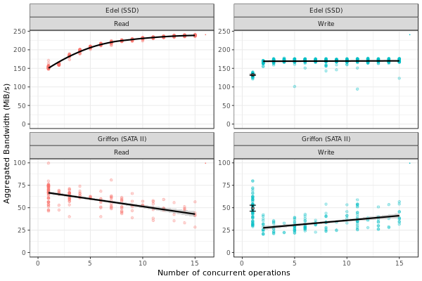
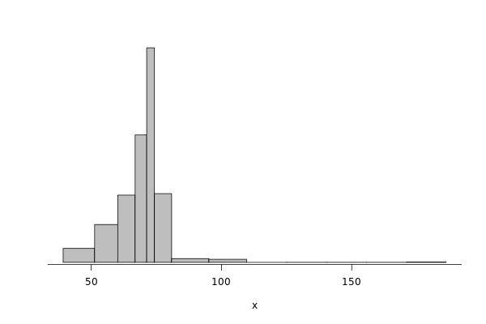
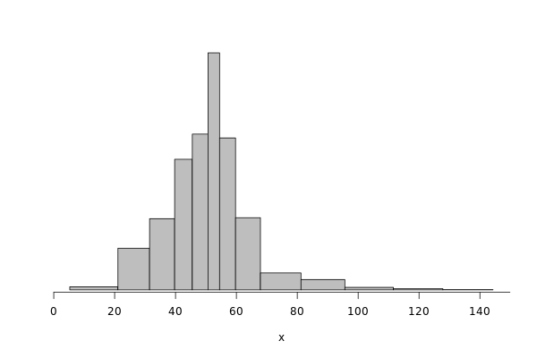
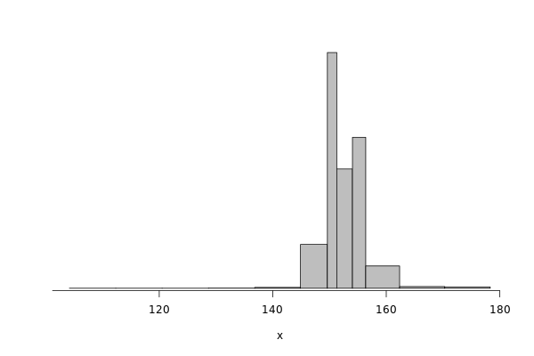
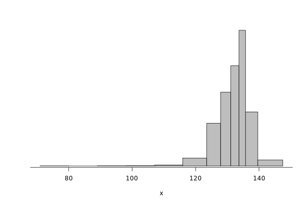
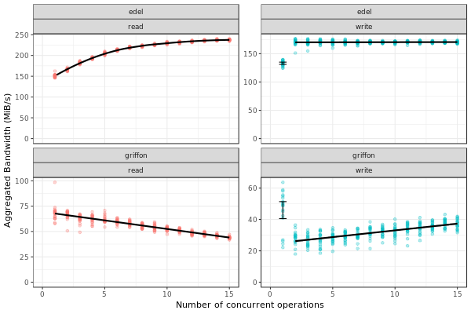

.. _howto_disk:

Modeling I/O: the realistic way
-------------------------------

Introduction
~~~~~~~~~~~~

This tutorial presents how to perform faithful IO experiments in
SimGrid. It is based on the paper "Adding Storage Simulation
Capacities to the SimGridToolkit: Concepts, Models, and API".

The paper presents a series of experiments to analyze the performance
of IO operations (read/write) on different kinds of disks (SATA, SAS,
SSD). In this tutorial, we show how to extract this data to simulate
both performance degradation with concurrent operations (Fig. 8 in the
paper) and variability in IO operations (Fig. 5 to 7).

- Link for paper: `https://hal.inria.fr/hal-01197128 <https://hal.inria.fr/hal-01197128>`_

- Link for data: `https://figshare.com/articles/dataset/Companion_of_the_SimGrid_storage_modeling_article/1175156 <https://figshare.com/articles/dataset/Companion_of_the_SimGrid_storage_modeling_article/1175156>`_

**WARNING**: The purpose of this document is to illustrate how we can
extract data from experiments and inject on SimGrid. However, the
results may **not** reflect the reality.

Running this tutorial
^^^^^^^^^^^^^^^^^^^^^

A Dockerfile is available in ``docs/source/tuto_disk``. It allows you to
re-run this tutorial. For that, build the image and run the container:

- ``docker build -t tuto_disk .``

- ``docker run -it tuto_disk``

Analyzing the experimental data
~~~~~~~~~~~~~~~~~~~~~~~~~~~~~~~

We start by analyzing and extracting the real data available.

Scripts
^^^^^^^

We use a special method to create non-uniform histograms to represent
the noise in IO operations. 

Unable to install the library properly, I copied the important methods
here.

Copied from: `https://rdrr.io/github/dlebauer/pecan-priors/src/R/plots.R <https://rdrr.io/github/dlebauer/pecan-priors/src/R/plots.R>`_

Data preparation
^^^^^^^^^^^^^^^^

Some initial configurations/list of packages.

.. code:: R

    library(jsonlite)
    library(ggplot2)
    library(plyr)
    library(dplyr)
    library(gridExtra)

    IO_INFO = list()

::

    Use suppressPackageStartupMessages() to eliminate package startup
    messages.

    Attaching package: 'dplyr'

    The following objects are masked from 'package:plyr':

        arrange, count, desc, failwith, id, mutate, rename, summarise,
        summarize

    The following objects are masked from 'package:stats':

        filter, lag

    The following objects are masked from 'package:base':

        intersect, setdiff, setequal, union

    Attaching package: 'gridExtra'

    The following object is masked from 'package:dplyr':

        combine

This was copied from the ``sg_storage_ccgrid15.org`` available at the
figshare of the paper. Before executing this code, please download and
decompress the appropriate file.

.. code:: sh

    curl -O -J -L "https://ndownloader.figshare.com/files/1928095"
    tar xfz bench.tgz

Preparing data for varialiby analysis.

.. code:: R

    clean_up <- function (df, infra){
    names(df) <- c("Hostname","Date","DirectIO","IOengine","IOscheduler","Error","Operation","Jobs","BufferSize","FileSize","Runtime","Bandwidth","BandwidthMin","BandwidthMax","Latency", "LatencyMin", "LatencyMax","IOPS")
    df=subset(df,Error=="0")
    df=subset(df,DirectIO=="1")
    df <- merge(df,infra,by="Hostname")
    df$Hostname = sapply(strsplit(df$Hostname, "[.]"), "[", 1)
    df$HostModel = paste(df$Hostname, df$Model, sep=" - ")
    df$Duration = df$Runtime/1000 # fio outputs runtime in msec, we want to display seconds
    df$Size = df$FileSize/1024/1024
    df=subset(df,Duration!=0.000)
    df$Bwi=df$Duration/df$Size
    df[df$Operation=="read",]$Operation<- "Read"
    df[df$Operation=="write",]$Operation<- "Write"
    return(df)
    }

    grenoble <- read.csv('./bench/grenoble.csv', header=FALSE,sep = ";",
    stringsAsFactors=FALSE)
    luxembourg <- read.csv('./bench/luxembourg.csv', header=FALSE,sep = ";",  stringsAsFactors=FALSE)
    nancy <- read.csv('./bench/nancy.csv', header=FALSE,sep = ";",  stringsAsFactors=FALSE)
    all <- rbind(grenoble,nancy, luxembourg)
    infra <- read.csv('./bench/infra.csv', header=FALSE,sep = ";",  stringsAsFactors=FALSE)
    names(infra) <- c("Hostname","Model","DiskSize")

    all = clean_up(all, infra)
    griffon = subset(all,grepl("^griffon", Hostname))
    griffon$Cluster <-"Griffon (SATA II)"
    edel = subset(all,grepl("^edel", Hostname))
    edel$Cluster<-"Edel (SSD)"

    df = rbind(griffon[griffon$Jobs=="1" & griffon$IOscheduler=="cfq",],
               edel[edel$Jobs=="1" & edel$IOscheduler=="cfq",])
    #Get rid off of 64 Gb disks of Edel as they behave differently (used to be "edel-51")
    df = df[!(grepl("^Edel",df$Cluster) & df$DiskSize=="64 GB"),]

Preparing data for concurrent analysis.

.. code:: R

    dfc = rbind(griffon[griffon$Jobs>1 & griffon$IOscheduler=="cfq",],
               edel[edel$Jobs>1 & edel$IOscheduler=="cfq",])
    dfc2 = rbind(griffon[griffon$Jobs==1 & griffon$IOscheduler=="cfq",],
               edel[edel$Jobs==1 & edel$IOscheduler=="cfq",])
    dfc = rbind(dfc,dfc2[sample(nrow(dfc2),size=200),])

    dd <- data.frame(
          Hostname="??",
          Date = NA, #tmpl$Date,
          DirectIO = NA,
          IOengine = NA,
          IOscheduler = NA,
          Error = 0,
          Operation = NA, #tmpl$Operation,
          Jobs = NA, # #d$nb.of.concurrent.access,
          BufferSize = NA, #d$bs,
          FileSize = NA, #d$size,
          Runtime = NA,
          Bandwidth = NA,
          BandwidthMin = NA,
          BandwidthMax = NA,
          Latency = NA,
          LatencyMin = NA,
          LatencyMax = NA,
          IOPS = NA,
          Model = NA, #tmpl$Model,
          DiskSize = NA, #tmpl$DiskSize,
          HostModel = NA,
          Duration = NA, #d$time,
          Size = NA,
          Bwi = NA,
          Cluster = NA) #tmpl$Cluster)

    dd$Size = dd$FileSize/1024/1024
    dd$Bwi = dd$Duration/dd$Size

    dfc = rbind(dfc, dd)
    # Let's get rid of small files!
    dfc = subset(dfc,Size >= 10)
    # Let's get rid of 64Gb edel disks
    dfc = dfc[!(grepl("^Edel",dfc$Cluster) & dfc$DiskSize=="64 GB"),]

    dfc$TotalSize=dfc$Size * dfc$Jobs
    dfc$BW = (dfc$TotalSize) / dfc$Duration
    dfc = dfc[dfc$BW>=20,] # get rid of one point that is typically an outlier and does not make sense

    dfc$method="lm"
    dfc[dfc$Cluster=="Edel (SSD)"  & dfc$Operation=="Read",]$method="loess"

    dfc[dfc$Cluster=="Edel (SSD)"  & dfc$Operation=="Write" & dfc$Jobs ==1,]$method="lm"
    dfc[dfc$Cluster=="Edel (SSD)"  & dfc$Operation=="Write" & dfc$Jobs ==1,]$method=""

    dfc[dfc$Cluster=="Griffon (SATA II)" & dfc$Operation=="Write",]$method="lm"
    dfc[dfc$Cluster=="Griffon (SATA II)"  & dfc$Operation=="Write" & dfc$Jobs ==1,]$method=""

    dfd = dfc[dfc$Operation=="Write" & dfc$Jobs ==1 &
              (dfc$Cluster %in% c("Griffon (SATA II)", "Edel (SSD)")),]
    dfd = ddply(dfd,c("Cluster","Operation","Jobs","DiskSize"), summarize,
                mean = mean(BW), num = length(BW), sd = sd(BW))
    dfd$BW=dfd$mean
    dfd$ci = 2*dfd$sd/sqrt(dfd$num)

    dfrange=ddply(dfc,c("Cluster","Operation","DiskSize"), summarize,
                max = max(BW))
    dfrange=ddply(dfrange,c("Cluster","DiskSize"), mutate,
                BW = max(max))
    dfrange$Jobs=16

Griffon (SATA)
^^^^^^^^^^^^^^

Modeling resource sharing w/ concurrent access
::::::::::::::::::::::::::::::::::::::::::::::

This figure presents the overall performance of IO operation with
concurrent access to the disk. Note that the image is different
from the one in the paper. Probably, we need to further clean the
available data to obtain exaclty the same results.

.. code:: R

    ggplot(data=dfc,aes(x=Jobs,y=BW, color=Operation)) + theme_bw() +
      geom_point(alpha=.3) +
      geom_point(data=dfrange, size=0) +
      facet_wrap(Cluster~Operation,ncol=2,scale="free_y")+ # ) + #
      geom_smooth(data=dfc[dfc$method=="loess",], color="black", method=loess,se=TRUE,fullrange=T) +
      geom_smooth(data=dfc[dfc$method=="lm",], color="black", method=lm,se=TRUE) +
      geom_point(data=dfd, aes(x=Jobs,y=BW),color="black",shape=21,fill="white") +
      geom_errorbar(data=dfd, aes(x=Jobs, ymin=BW-ci, ymax=BW+ci),color="black",width=.6) +
      xlab("Number of concurrent operations") + ylab("Aggregated Bandwidth (MiB/s)")  + guides(color=FALSE)  + xlim(0,NA) + ylim(0,NA)

Read
''''

Getting read data for Griffon from 1 to 15 concurrent reads.

.. code:: R

    deg_griffon = dfc %>% filter(grepl("^Griffon", Cluster)) %>% filter(Operation == "Read")
    model = lm(BW~Jobs, data = deg_griffon)
    IO_INFO[["griffon"]][["degradation"]][["read"]] = predict(model,data.frame(Jobs=seq(1,15)))

    toJSON(IO_INFO, pretty = TRUE)

::

    {
      "griffon": {
        "degradation": {
          "read": [66.6308, 64.9327, 63.2346, 61.5365, 59.8384, 58.1403, 56.4423, 54.7442, 53.0461, 51.348, 49.6499, 47.9518, 46.2537, 44.5556, 42.8575]
        }
      }
    }

Write
'''''

Same for write operations.

.. code:: R

    deg_griffon = dfc %>% filter(grepl("^Griffon", Cluster)) %>% filter(Operation == "Write") %>% filter(Jobs > 2)
    mean_job_1 = dfc %>% filter(grepl("^Griffon", Cluster)) %>% filter(Operation == "Write") %>% filter(Jobs == 1) %>% summarize(mean = mean(BW))
    model = lm(BW~Jobs, data = deg_griffon)
    IO_INFO[["griffon"]][["degradation"]][["write"]] = c(mean_job_1$mean, predict(model,data.frame(Jobs=seq(2,15))))
    toJSON(IO_INFO, pretty = TRUE)

::

    {
      "griffon": {
        "degradation": {
          "read": [66.6308, 64.9327, 63.2346, 61.5365, 59.8384, 58.1403, 56.4423, 54.7442, 53.0461, 51.348, 49.6499, 47.9518, 46.2537, 44.5556, 42.8575],
          "write": [49.4576, 26.5981, 27.7486, 28.8991, 30.0495, 31.2, 32.3505, 33.501, 34.6515, 35.8019, 36.9524, 38.1029, 39.2534, 40.4038, 41.5543]
        }
      }
    }

Modeling read/write bandwidth variability
:::::::::::::::::::::::::::::::::::::::::

Fig.5 in the paper presents the noise in the read/write operations in
the Griffon SATA disk.

The paper uses regular histogram to illustrate the distribution of the
effective bandwidth. However, in this tutorial, we use dhist
(`https://rdrr.io/github/dlebauer/pecan-priors/man/dhist.html <https://rdrr.io/github/dlebauer/pecan-priors/man/dhist.html>`_) to have a
more precise information over the highly dense areas around the mean.

Read
''''

First, we present the histogram for read operations.

.. code:: R

    griffon_read = df %>% filter(grepl("^Griffon", Cluster)) %>% filter(Operation == "Read") %>% select(Bwi)
    dhist(1/griffon_read$Bwi)

Saving it to be exported in json format.

.. code:: R

    griffon_read_dhist = dhist(1/griffon_read$Bwi, plot=FALSE)
    IO_INFO[["griffon"]][["noise"]][["read"]] = c(breaks=list(griffon_read_dhist$xbr), heights=list(unclass(griffon_read_dhist$heights)))
    IO_INFO[["griffon"]][["read_bw"]] = mean(1/griffon_read$Bwi)
    toJSON(IO_INFO, pretty = TRUE)

::

    Warning message:
    In hist.default(x, breaks = cut.pt, plot = FALSE, probability = TRUE) :
      argument 'probability' is not made use of

    {
      "griffon": {
        "degradation": {
          "read": [66.6308, 64.9327, 63.2346, 61.5365, 59.8384, 58.1403, 56.4423, 54.7442, 53.0461, 51.348, 49.6499, 47.9518, 46.2537, 44.5556, 42.8575],
          "write": [49.4576, 26.5981, 27.7486, 28.8991, 30.0495, 31.2, 32.3505, 33.501, 34.6515, 35.8019, 36.9524, 38.1029, 39.2534, 40.4038, 41.5543]
        },
        "noise": {
          "read": {
    	"breaks": [39.257, 51.3413, 60.2069, 66.8815, 71.315, 74.2973, 80.8883, 95.1944, 109.6767, 125.0231, 140.3519, 155.6807, 171.0094, 186.25],
    	"heights": [15.3091, 41.4578, 73.6826, 139.5982, 235.125, 75.3357, 4.1241, 3.3834, 0, 0.0652, 0.0652, 0.0652, 0.3937]
          }
        },
        "read_bw": [68.5425]
      }
    }

Write
'''''

Same analysis for write operations.

.. code:: R

    griffon_write = df %>% filter(grepl("^Griffon", Cluster)) %>% filter(Operation == "Write") %>% select(Bwi)
    dhist(1/griffon_write$Bwi)

.. code:: R

    griffon_write_dhist = dhist(1/griffon_write$Bwi, plot=FALSE)
    IO_INFO[["griffon"]][["noise"]][["write"]] = c(breaks=list(griffon_write_dhist$xbr), heights=list(unclass(griffon_write_dhist$heights)))
    IO_INFO[["griffon"]][["write_bw"]] = mean(1/griffon_write$Bwi)
    toJSON(IO_INFO, pretty = TRUE)

::

    Warning message:
    In hist.default(x, breaks = cut.pt, plot = FALSE, probability = TRUE) :
      argument 'probability' is not made use of

    {
      "griffon": {
        "degradation": {
          "read": [66.6308, 64.9327, 63.2346, 61.5365, 59.8384, 58.1403, 56.4423, 54.7442, 53.0461, 51.348, 49.6499, 47.9518, 46.2537, 44.5556, 42.8575],
          "write": [49.4576, 26.5981, 27.7486, 28.8991, 30.0495, 31.2, 32.3505, 33.501, 34.6515, 35.8019, 36.9524, 38.1029, 39.2534, 40.4038, 41.5543]
        },
        "noise": {
          "read": {
    	"breaks": [39.257, 51.3413, 60.2069, 66.8815, 71.315, 74.2973, 80.8883, 95.1944, 109.6767, 125.0231, 140.3519, 155.6807, 171.0094, 186.25],
    	"heights": [15.3091, 41.4578, 73.6826, 139.5982, 235.125, 75.3357, 4.1241, 3.3834, 0, 0.0652, 0.0652, 0.0652, 0.3937]
          },
          "write": {
    	"breaks": [5.2604, 21.0831, 31.4773, 39.7107, 45.5157, 50.6755, 54.4726, 59.7212, 67.8983, 81.2193, 95.6333, 111.5864, 127.8409, 144.3015],
    	"heights": [1.7064, 22.6168, 38.613, 70.8008, 84.4486, 128.5118, 82.3692, 39.1431, 9.2256, 5.6195, 1.379, 0.6429, 0.1549]
          }
        },
        "read_bw": [68.5425],
        "write_bw": [50.6045]
      }
    }

Edel (SSD)
^^^^^^^^^^

This section presents the exactly same analysis for the Edel SSDs.

Modeling resource sharing w/ concurrent access
::::::::::::::::::::::::::::::::::::::::::::::

Read
''''

Getting read data for Edel from 1 to 15 concurrent operations.

.. code:: R

    deg_edel = dfc %>% filter(grepl("^Edel", Cluster)) %>% filter(Operation == "Read")
    model = loess(BW~Jobs, data = deg_edel)
    IO_INFO[["edel"]][["degradation"]][["read"]] = predict(model,data.frame(Jobs=seq(1,15)))
    toJSON(IO_INFO, pretty = TRUE)

::

    {
      "griffon": {
        "degradation": {
          "read": [66.6308, 64.9327, 63.2346, 61.5365, 59.8384, 58.1403, 56.4423, 54.7442, 53.0461, 51.348, 49.6499, 47.9518, 46.2537, 44.5556, 42.8575],
          "write": [49.4576, 26.5981, 27.7486, 28.8991, 30.0495, 31.2, 32.3505, 33.501, 34.6515, 35.8019, 36.9524, 38.1029, 39.2534, 40.4038, 41.5543]
        },
        "noise": {
          "read": {
    	"breaks": [39.257, 51.3413, 60.2069, 66.8815, 71.315, 74.2973, 80.8883, 95.1944, 109.6767, 125.0231, 140.3519, 155.6807, 171.0094, 186.25],
    	"heights": [15.3091, 41.4578, 73.6826, 139.5982, 235.125, 75.3357, 4.1241, 3.3834, 0, 0.0652, 0.0652, 0.0652, 0.3937]
          },
          "write": {
    	"breaks": [5.2604, 21.0831, 31.4773, 39.7107, 45.5157, 50.6755, 54.4726, 59.7212, 67.8983, 81.2193, 95.6333, 111.5864, 127.8409, 144.3015],
    	"heights": [1.7064, 22.6168, 38.613, 70.8008, 84.4486, 128.5118, 82.3692, 39.1431, 9.2256, 5.6195, 1.379, 0.6429, 0.1549]
          }
        },
        "read_bw": [68.5425],
        "write_bw": [50.6045]
      },
      "edel": {
        "degradation": {
          "read": [150.5119, 167.4377, 182.2945, 195.1004, 205.8671, 214.1301, 220.411, 224.6343, 227.7141, 230.6843, 233.0923, 235.2027, 236.8369, 238.0249, 238.7515]
        }
      }
    }

Write
'''''

Same for write operations.

.. code:: R

    deg_edel = dfc %>% filter(grepl("^Edel", Cluster)) %>% filter(Operation == "Write") %>% filter(Jobs > 2)
    mean_job_1 = dfc %>% filter(grepl("^Edel", Cluster)) %>% filter(Operation == "Write") %>% filter(Jobs == 1) %>% summarize(mean = mean(BW))
    model = lm(BW~Jobs, data = deg_edel)
    IO_INFO[["edel"]][["degradation"]][["write"]] = c(mean_job_1$mean, predict(model,data.frame(Jobs=seq(2,15))))
    toJSON(IO_INFO, pretty = TRUE)

::

    {
      "griffon": {
        "degradation": {
          "read": [66.6308, 64.9327, 63.2346, 61.5365, 59.8384, 58.1403, 56.4423, 54.7442, 53.0461, 51.348, 49.6499, 47.9518, 46.2537, 44.5556, 42.8575],
          "write": [49.4576, 26.5981, 27.7486, 28.8991, 30.0495, 31.2, 32.3505, 33.501, 34.6515, 35.8019, 36.9524, 38.1029, 39.2534, 40.4038, 41.5543]
        },
        "noise": {
          "read": {
    	"breaks": [39.257, 51.3413, 60.2069, 66.8815, 71.315, 74.2973, 80.8883, 95.1944, 109.6767, 125.0231, 140.3519, 155.6807, 171.0094, 186.25],
    	"heights": [15.3091, 41.4578, 73.6826, 139.5982, 235.125, 75.3357, 4.1241, 3.3834, 0, 0.0652, 0.0652, 0.0652, 0.3937]
          },
          "write": {
    	"breaks": [5.2604, 21.0831, 31.4773, 39.7107, 45.5157, 50.6755, 54.4726, 59.7212, 67.8983, 81.2193, 95.6333, 111.5864, 127.8409, 144.3015],
    	"heights": [1.7064, 22.6168, 38.613, 70.8008, 84.4486, 128.5118, 82.3692, 39.1431, 9.2256, 5.6195, 1.379, 0.6429, 0.1549]
          }
        },
        "read_bw": [68.5425],
        "write_bw": [50.6045]
      },
      "edel": {
        "degradation": {
          "read": [150.5119, 167.4377, 182.2945, 195.1004, 205.8671, 214.1301, 220.411, 224.6343, 227.7141, 230.6843, 233.0923, 235.2027, 236.8369, 238.0249, 238.7515],
          "write": [132.2771, 170.174, 170.137, 170.1, 170.063, 170.026, 169.9889, 169.9519, 169.9149, 169.8779, 169.8408, 169.8038, 169.7668, 169.7298, 169.6927]
        }
      }
    }

Modeling read/write bandwidth variability
:::::::::::::::::::::::::::::::::::::::::

Read
''''

.. code:: R

    edel_read = df %>% filter(grepl("^Edel", Cluster)) %>% filter(Operation == "Read") %>% select(Bwi)
    dhist(1/edel_read$Bwi)

Saving it to be exported in json format.

.. code:: R

    edel_read_dhist = dhist(1/edel_read$Bwi, plot=FALSE)
    IO_INFO[["edel"]][["noise"]][["read"]] = c(breaks=list(edel_read_dhist$xbr), heights=list(unclass(edel_read_dhist$heights)))
    IO_INFO[["edel"]][["read_bw"]] = mean(1/edel_read$Bwi)
    toJSON(IO_INFO, pretty = TRUE)

::

    Warning message:
    In hist.default(x, breaks = cut.pt, plot = FALSE, probability = TRUE) :
      argument 'probability' is not made use of

    {
      "griffon": {
        "degradation": {
          "read": [66.6308, 64.9327, 63.2346, 61.5365, 59.8384, 58.1403, 56.4423, 54.7442, 53.0461, 51.348, 49.6499, 47.9518, 46.2537, 44.5556, 42.8575],
          "write": [49.4576, 26.5981, 27.7486, 28.8991, 30.0495, 31.2, 32.3505, 33.501, 34.6515, 35.8019, 36.9524, 38.1029, 39.2534, 40.4038, 41.5543]
        },
        "noise": {
          "read": {
    	"breaks": [39.257, 51.3413, 60.2069, 66.8815, 71.315, 74.2973, 80.8883, 95.1944, 109.6767, 125.0231, 140.3519, 155.6807, 171.0094, 186.25],
    	"heights": [15.3091, 41.4578, 73.6826, 139.5982, 235.125, 75.3357, 4.1241, 3.3834, 0, 0.0652, 0.0652, 0.0652, 0.3937]
          },
          "write": {
    	"breaks": [5.2604, 21.0831, 31.4773, 39.7107, 45.5157, 50.6755, 54.4726, 59.7212, 67.8983, 81.2193, 95.6333, 111.5864, 127.8409, 144.3015],
    	"heights": [1.7064, 22.6168, 38.613, 70.8008, 84.4486, 128.5118, 82.3692, 39.1431, 9.2256, 5.6195, 1.379, 0.6429, 0.1549]
          }
        },
        "read_bw": [68.5425],
        "write_bw": [50.6045]
      },
      "edel": {
        "degradation": {
          "read": [150.5119, 167.4377, 182.2945, 195.1004, 205.8671, 214.1301, 220.411, 224.6343, 227.7141, 230.6843, 233.0923, 235.2027, 236.8369, 238.0249, 238.7515],
          "write": [132.2771, 170.174, 170.137, 170.1, 170.063, 170.026, 169.9889, 169.9519, 169.9149, 169.8779, 169.8408, 169.8038, 169.7668, 169.7298, 169.6927]
        },
        "noise": {
          "read": {
    	"breaks": [104.1667, 112.3335, 120.5003, 128.6671, 136.8222, 144.8831, 149.6239, 151.2937, 154.0445, 156.3837, 162.3555, 170.3105, 178.3243],
    	"heights": [0.1224, 0.1224, 0.1224, 0.2452, 1.2406, 61.6128, 331.2201, 167.6488, 212.1086, 31.3996, 2.3884, 1.747]
          }
        },
        "read_bw": [152.7139]
      }
    }

Write
'''''

.. code:: R

    edel_write = df %>% filter(grepl("^Edel", Cluster)) %>% filter(Operation == "Write") %>% select(Bwi)
    dhist(1/edel_write$Bwi)

Saving it to be exported later.

.. code:: R

    edel_write_dhist = dhist(1/edel_write$Bwi, plot=FALSE)
    IO_INFO[["edel"]][["noise"]][["write"]] = c(breaks=list(edel_write_dhist$xbr), heights=list(unclass(edel_write_dhist$heights)))
    IO_INFO[["edel"]][["write_bw"]] = mean(1/edel_write$Bwi)
    toJSON(IO_INFO, pretty = TRUE)

::

    Warning message:
    In hist.default(x, breaks = cut.pt, plot = FALSE, probability = TRUE) :
      argument 'probability' is not made use of

    {
      "griffon": {
        "degradation": {
          "read": [66.6308, 64.9327, 63.2346, 61.5365, 59.8384, 58.1403, 56.4423, 54.7442, 53.0461, 51.348, 49.6499, 47.9518, 46.2537, 44.5556, 42.8575],
          "write": [49.4576, 26.5981, 27.7486, 28.8991, 30.0495, 31.2, 32.3505, 33.501, 34.6515, 35.8019, 36.9524, 38.1029, 39.2534, 40.4038, 41.5543]
        },
        "noise": {
          "read": {
    	"breaks": [39.257, 51.3413, 60.2069, 66.8815, 71.315, 74.2973, 80.8883, 95.1944, 109.6767, 125.0231, 140.3519, 155.6807, 171.0094, 186.25],
    	"heights": [15.3091, 41.4578, 73.6826, 139.5982, 235.125, 75.3357, 4.1241, 3.3834, 0, 0.0652, 0.0652, 0.0652, 0.3937]
          },
          "write": {
    	"breaks": [5.2604, 21.0831, 31.4773, 39.7107, 45.5157, 50.6755, 54.4726, 59.7212, 67.8983, 81.2193, 95.6333, 111.5864, 127.8409, 144.3015],
    	"heights": [1.7064, 22.6168, 38.613, 70.8008, 84.4486, 128.5118, 82.3692, 39.1431, 9.2256, 5.6195, 1.379, 0.6429, 0.1549]
          }
        },
        "read_bw": [68.5425],
        "write_bw": [50.6045]
      },
      "edel": {
        "degradation": {
          "read": [150.5119, 167.4377, 182.2945, 195.1004, 205.8671, 214.1301, 220.411, 224.6343, 227.7141, 230.6843, 233.0923, 235.2027, 236.8369, 238.0249, 238.7515],
          "write": [132.2771, 170.174, 170.137, 170.1, 170.063, 170.026, 169.9889, 169.9519, 169.9149, 169.8779, 169.8408, 169.8038, 169.7668, 169.7298, 169.6927]
        },
        "noise": {
          "read": {
    	"breaks": [104.1667, 112.3335, 120.5003, 128.6671, 136.8222, 144.8831, 149.6239, 151.2937, 154.0445, 156.3837, 162.3555, 170.3105, 178.3243],
    	"heights": [0.1224, 0.1224, 0.1224, 0.2452, 1.2406, 61.6128, 331.2201, 167.6488, 212.1086, 31.3996, 2.3884, 1.747]
          },
          "write": {
    	"breaks": [70.9593, 79.9956, 89.0654, 98.085, 107.088, 115.9405, 123.5061, 127.893, 131.083, 133.6696, 135.7352, 139.5932, 147.4736],
    	"heights": [0.2213, 0, 0.3326, 0.4443, 1.4685, 11.8959, 63.869, 110.286, 149.9741, 202.887, 80.8298, 9.0298]
          }
        },
        "read_bw": [152.7139],
        "write_bw": [131.7152]
      }
    }

Exporting to JSON
~~~~~~~~~~~~~~~~~

Finally, let's save it to a file to be opened by our simulator.

.. code:: R

    json = toJSON(IO_INFO, pretty = TRUE)
    cat(json, file="IO_noise.json")

Injecting this data in SimGrid
~~~~~~~~~~~~~~~~~~~~~~~~~~~~~~

To mimic this behavior in SimGrid, we use two features in the platform
description: non-linear sharing policy and bandwidth factors. For more
details, please see the source code in ``tuto_disk.cpp``.

Modeling resource sharing w/ concurrent access
^^^^^^^^^^^^^^^^^^^^^^^^^^^^^^^^^^^^^^^^^^^^^^

The ``set_sharing_policy`` method allows the user to set a callback to
dynamically change the disk capacity. The callback is called each time
SimGrid will share the disk between a set of I/O operations.

The callback has access to the number of activities sharing the
resource and its current capacity. It must return the new resource's
capacity.

.. code:: C++

    static double disk_dynamic_sharing(double capacity, int n)
    {
       return capacity; //useless callback
    }

    auto* disk = host->create_disk("dump", 1e6, 1e6);
    disk->set_sharing_policy(sg4::Disk::Operation::READ, sg4::Disk::SharingPolicy::NONLINEAR, &disk_dynamic_sharing);

Modeling read/write bandwidth variability
^^^^^^^^^^^^^^^^^^^^^^^^^^^^^^^^^^^^^^^^^

The noise in I/O operations can be obtained by applying a factor to
the I/O bandwidth of the disk. This factor is applied when we update
the remaining amount of bytes to be transferred, increasing or
decreasing the effective disk bandwidth.

The ``set_factor`` method allows the user to set a callback to
dynamically change the factor to be applied for each I/O operation.
The callback has access to size of the operation and its type (read or
write). It must return a multiply factor (e.g. 1.0 for doing nothing).

.. code:: C++

    static double disk_variability(sg_size_t size, sg4::Io::OpType op)
    {
       return 1.0; //useless callback
    }

    auto* disk = host->create_disk("dump", 1e6, 1e6);
    disk->set_factor_cb(&disk_variability);

Running our simulation
^^^^^^^^^^^^^^^^^^^^^^

The binary was compiled in the provided docker container.

.. code:: sh

    ./tuto_disk > ./simgrid_disk.csv

Analyzing the SimGrid results
~~~~~~~~~~~~~~~~~~~~~~~~~~~~~

The figure below presents the results obtained by SimGrid.

The experiment performs I/O operations, varying the number of
concurrent operations from 1 to 15. We run only 20 simulations for
each case.

We can see that the graphics are quite similar to the ones obtained in
the real platform.

.. code:: R

    sg_df = read.csv("./simgrid_disk.csv")
    sg_df = sg_df %>% group_by(disk, op, flows) %>% mutate(bw=((size*flows)/elapsed)/10^6, method=if_else(disk=="edel" & op=="read", "loess", "lm"))
    sg_dfd = sg_df %>% filter(flows==1 & op=="write") %>% group_by(disk, op, flows) %>% summarize(mean = mean(bw), sd = sd(bw), se=sd/sqrt(n()))

    sg_df[sg_df$op=="write" & sg_df$flows ==1,]$method=""

    ggplot(data=sg_df, aes(x=flows, y=bw, color=op)) + theme_bw() +
        geom_point(alpha=.3) + 
        geom_smooth(data=sg_df[sg_df$method=="loess",], color="black", method=loess,se=TRUE,fullrange=T) +
        geom_smooth(data=sg_df[sg_df$method=="lm",], color="black", method=lm,se=TRUE) +
        geom_errorbar(data=sg_dfd, aes(x=flows, y=mean, ymin=mean-2*se, ymax=mean+2*se),color="black",width=.6) +
        facet_wrap(disk~op,ncol=2,scale="free_y")+ # ) + #
        xlab("Number of concurrent operations") + ylab("Aggregated Bandwidth (MiB/s)")  + guides(color=FALSE)  + xlim(0,NA) + ylim(0,NA)

Note: The variability in griffon read operation seems to decrease when
we have more concurrent operations. This is a particularity of the
griffon read speed profile and the elapsed time calculation.

Given that:

- Each point represents the time to perform the N I/O operations.

- Griffon read speed decreases with the number of concurrent
  operations.

With 15 read operations:

- At the beginning, every read gets the same bandwidth, about
  42MiB/s.

- We sample the noise in I/O operations, some will be faster than
  others (e.g. factor > 1).

When the first read operation finish:

- We will recalculate the bandwidth sharing, now considering that we
  have 14 active read operations. This will increase the bandwidth for
  each operation (about 44MiB/s).

- The remaining "slower" activities will be speed up.

This behavior keeps happening until the end of the 15 operations,
at each step, we speed up a little the slowest operations and
consequently, decreasing the variability we see.
